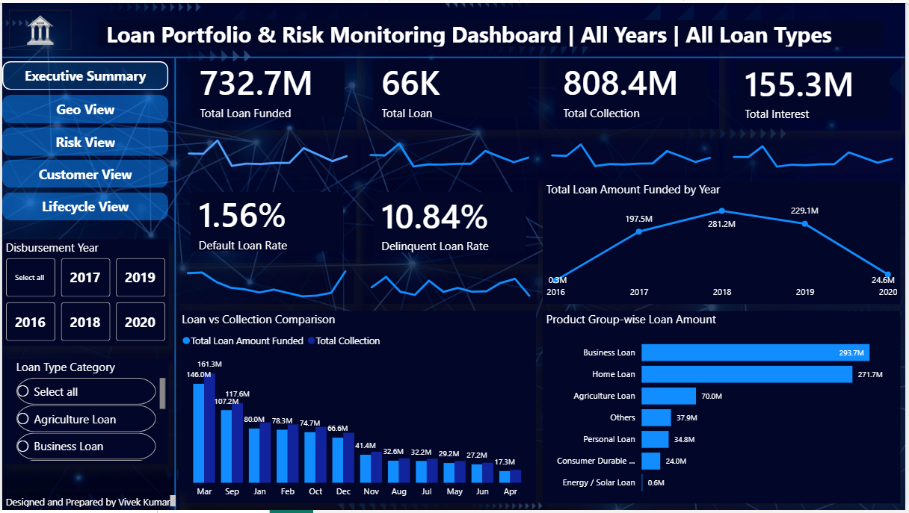
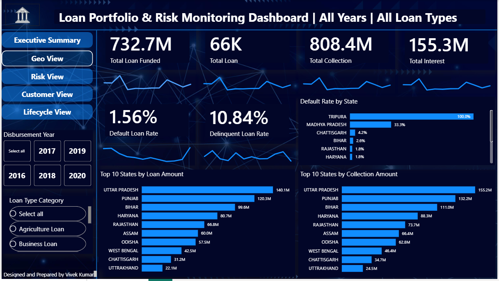
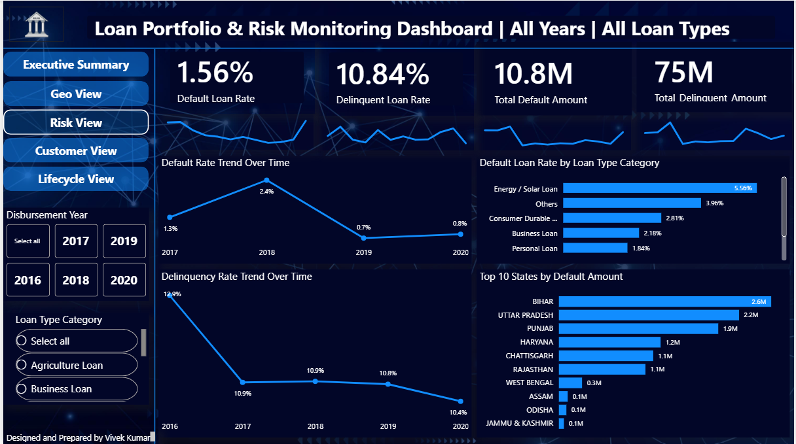
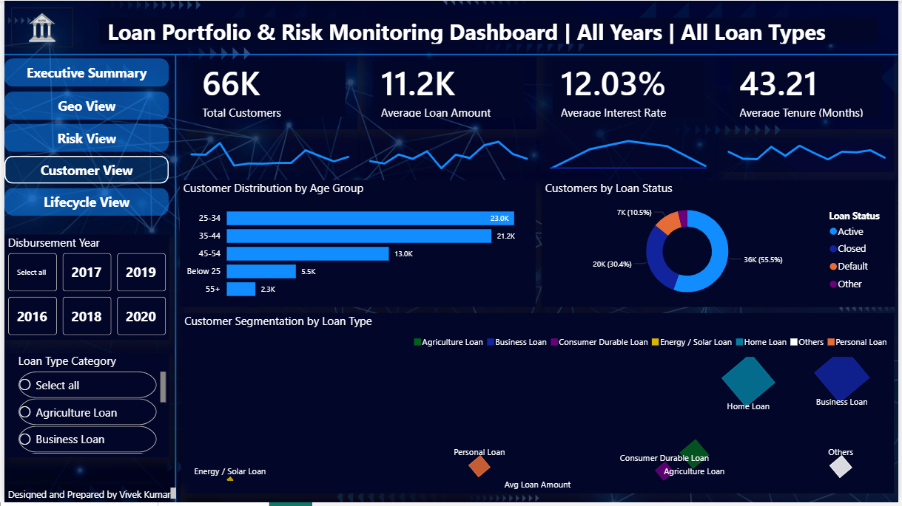
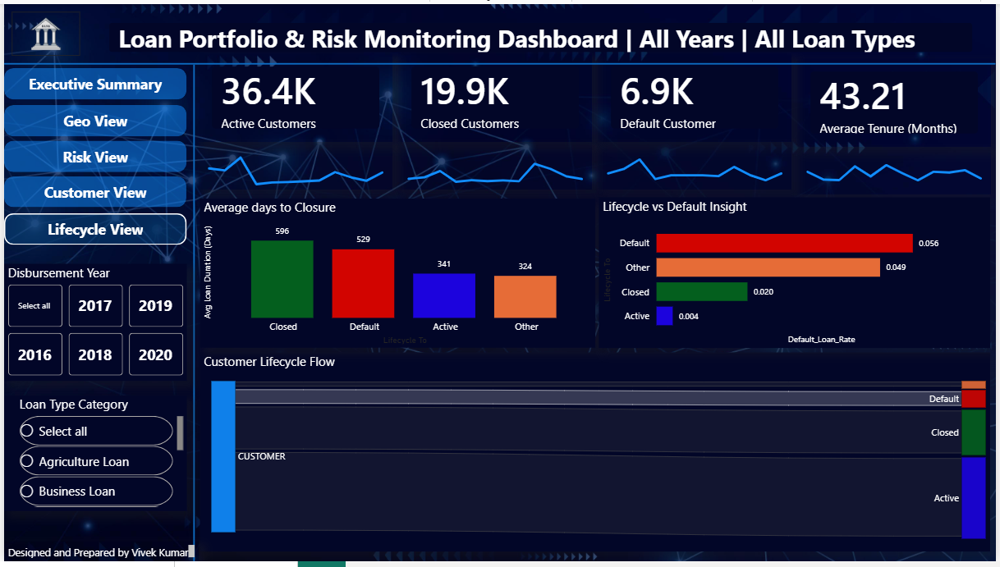

# Loan Portfolio & Risk Monitoring Dashboard (Power BI)

---

## 📌 Project Overview

This project showcases an **end-to-end Loan Portfolio & Risk Monitoring Dashboard** developed in **Power BI**, covering multiple analytical perspectives such as:

- Executive-level portfolio summary
- Geographic performance and risk exposure
- Credit risk and delinquency analysis
- Customer segmentation and behavior
- Loan lifecycle movement and default patterns

The dashboard is designed to replicate **real-world banking and NBFC analytics**, focusing on **decision-making, risk control, and portfolio optimization** rather than just visualization.

---

##  Purpose of the Project

The primary objective of this dashboard is to help business stakeholders:

- Monitor overall loan portfolio health
- Identify high-risk segments early
- Track defaults and delinquencies over time
- Understand customer distribution and behavior
- Analyze loan lifecycle movement from active to closure or default

This project demonstrates how **raw transactional data** can be transformed into **actionable business insights** using enterprise BI practices.

---

##  Tools & Technologies Used

- **Power BI Desktop**
- **Power Query Editor**
  - Data cleaning and transformation
  - Column standardization and enrichment
- **DAX (Data Analysis Expressions)**
  - KPI calculations
  - Time-based analysis
  - Risk and lifecycle metrics
- **Data Modeling**
  - Star schema design
  - Optimized relationships for performance

---

##  Data Modeling Approach

The dashboard follows a **Star Schema architecture**, commonly used in enterprise BI solutions:

### Fact Tables
- Loan Transactions
- Collections
- Customer Loan Status

### Dimension Tables
- Date
- Customer
- Geography (State)
- Loan Type
- Loan Status

This approach ensures:
- Better performance
- Reusable measures
- Clean separation between data and logic
- Scalability for future enhancements

---

##  Measures & Calculations (Enterprise-Level)

The dashboard uses **30+ DAX measures**, broadly categorized as:

### Portfolio KPIs
- Total Loan Funded
- Total Collection
- Total Interest
- Average Loan Amount
- Average Interest Rate
- Average Tenure

### Risk Metrics
- Default Loan Rate
- Delinquent Loan Rate
- Total Default Amount
- Total Delinquent Amount

### Customer Metrics
- Total Customers
- Active Customers
- Closed Customers
- Default Customers

### Time Intelligence
- Year-wise trends
- Monthly loan vs collection comparison
- Default and delinquency trends over time

All measures are centrally managed and reusable across multiple report pages.

---

##  Dashboard Screenshots

### 1️. Executive Summary View

### 2️. Geographic View

### 3️. Risk Analysis View

### 4️. Customer View

### 5️. Loan Lifecycle View

>  All screenshots are stored inside the `/screenshots` folder.

---

##  Business Insights from the Dashboard

###  Portfolio Performance
- The total loan disbursement of **732.7M** with collections exceeding **808M** indicates a strong recovery position.
- Loan disbursements peaked during 2017–2019, followed by a decline in 2020, highlighting potential macroeconomic or operational impact.

###  Risk & Credit Quality
- An overall **Default Rate of 1.56%** suggests a relatively controlled credit risk.
- However, the **Delinquency Rate of 10.84%** indicates early stress pockets that require monitoring.
- Certain loan categories such as **Energy / Solar Loans** and **Others** show comparatively higher default tendencies.

###  Geographic Risk Exposure
- States like **Bihar, Uttar Pradesh, and Punjab** consistently appear in top default and delinquency metrics.
- This insight helps risk teams focus regional credit policies and collection strategies.

###  Customer Behavior
- Majority of customers fall in the **25–44 age group**, indicating a working-age borrower base.
- Active customers dominate the portfolio, but a visible default segment highlights the importance of lifecycle tracking.

###  Loan Lifecycle Patterns
- Customers transitioning from **Active → Default** have significantly higher average tenure and exposure.
- The lifecycle flow clearly visualizes risk concentration points where intervention can reduce defaults.

---

##  How This Dashboard Helps Business Decisions

This dashboard enables stakeholders to:

- **Proactively manage credit risk** by identifying high-risk loan types and geographies
- **Improve collection strategies** by comparing loan vs collection trends
- **Optimize portfolio mix** by analyzing performance across loan categories
- **Strengthen customer lifecycle management** by tracking movement toward default
- **Support executive reporting** with a single, consolidated view of portfolio health

In a real-world scenario, this dashboard can directly support:
- Credit policy revisions
- Regional risk assessments
- Product-level performance reviews
- Strategic planning and forecasting

---

##  File Access & Usage

Due to file size limitations, the Power BI (.pbix) file is hosted externally.

 **Power BI File (View Access):**  
[Google Drive Link – PBIX File](https://drive.google.com/drive/folders/1QMuRMETPYMmIwdNht7wL3s2dM3w3PE-R?usp=sharing)

> Note: The repository is intentionally maintained as **read-only** for viewers.  
> Editing rights are restricted to ensure version control and data integrity.

---

##  Author

**Vivek Kumar**  
Data Analyst | Power BI | SQL | Data Modeling | Business Intelligence  

---

##  Disclaimer

This project is created for **learning, portfolio, and demonstration purposes** and does not represent real customer or banking data.

